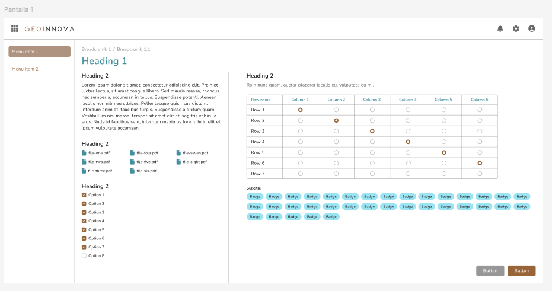

# Proyecto GeoInnova

Proyecto desarrollado como parte de un desafío técnico para GeoInnova. El objetivo es crear una aplicación web utilizando React, TypeScript y Bootstrap para mostrar habilidades en frontend.

## Contenido del Proyecto

El proyecto GeoInnova es un desafío técnico desarrollado utilizando React, TypeScript y Bootstrap para construir un frontend responsivo. Aquí se detalla la organización y los componentes principales del proyecto:

- **Descripción**: Desarrollo de una aplicación web frontend que muestra habilidades en React, TypeScript y Bootstrap, basada en un diseño proporcionado en Figma.

- **Tecnologías Utilizadas**: React, TypeScript, Bootstrap, HTML, CSS.

- **Componentes Principales**:
  - `App.tsx`: Componente principal que organiza la estructura de la aplicación.
  - `Header.tsx`: Encabezado de la aplicación que incluye el logo y acciones de usuario.
  - `Sidebar.tsx`: Barra lateral con opciones de menú.
  - `Text.tsx`, `Files.tsx`, `Checkboxes.tsx`, `Tables.tsx`, `Badges.tsx`, `Buttons.tsx`: Componentes para mostrar texto, archivos, checkboxes, tablas, badges y botones respectivamente.

- **Instalación y Ejecución**:
  - Clonar el repositorio: `git clone https://github.com/RocioLV/geoinnova-frontend-challenge.git`
  - Instalar dependencias: `npm install`
  - Ejecutar la aplicación: `npm start`

- **Gestión del Proyecto**: Utilización de Trello (https://trello.com/b/0Yq6WBm3) para la planificación y gestión de tareas.
  

- **Desarrolladora**: Rocío Lorca Villalobos